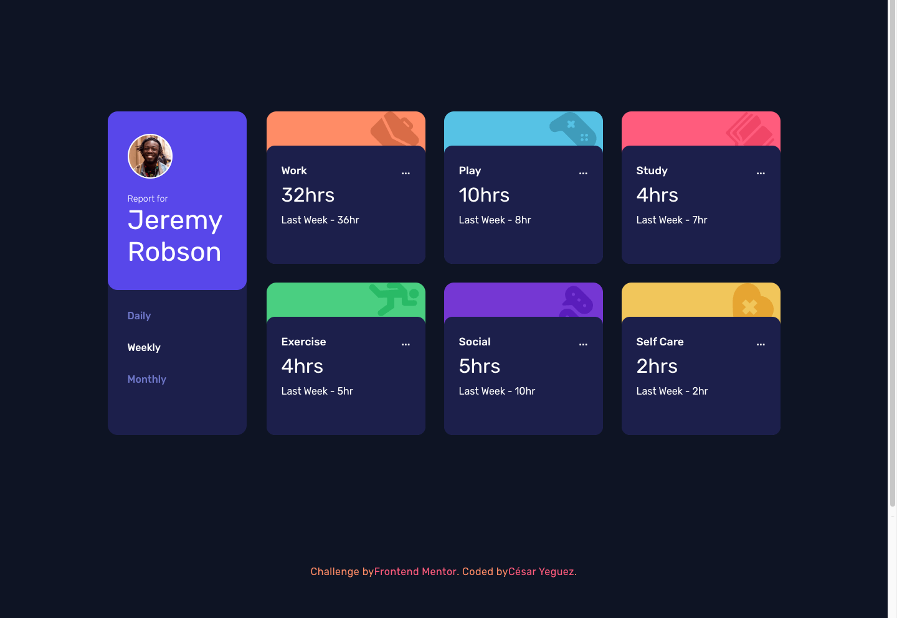

# Frontend Mentor - Time tracking dashboard solution

This is a solution to the [Time tracking dashboard challenge on Frontend Mentor](https://www.frontendmentor.io/challenges/time-tracking-dashboard-UIQ7167Jw). 
## Table of contents

- [Overview](#overview)
  - [The challenge](#the-challenge)
  - [Screenshot](#screenshot)
  - [Links](#links)
- [My process](#my-process)
  - [Built with](#built-with)
  - [What I learned](#what-i-learned) 
- [Author](#author)


## Overview
Hello, welcome, this is a challenge taken on the frontendMentor website which consists of showing a user screen with data on their action statistics in a time range.

### The challenge

Users should be able to:

- View the optimal layout for the site depending on their device's screen size
- See hover states for all interactive elements on the page
- Switch between viewing Daily, Weekly, and Monthly stats

### Screenshot




### Links

- Solution URL: [Time-tracking-dashboard GitHub](https://github.com/cyeguez/Time-tracking-dashboard)
- Live Site URL: [Github-Pages](https://cyeguez.github.io/Time-tracking-dashboard/)

## My process

- I configure the project architecture . 🏛️
- I clean the HTML of Comments and styles. 🧹
- I assign the HTML tags. 🎯
- I write the styles, I configure mediaquerys. 🕶️
- I create the logical part in JS. 🧠

### Built with


 
  
  
  


### What I learned

The use of templates and the dynamic generation of information, the updating of the dom, the use of local data.

To see how you can add code snippets, see below:

```
const template = 
  `<div class='activity-container activity-container--${nameClass}'> 
      <div class='activity'>
        <div class='activity__category'>
          <p>${title}</p>
          <p>...</p>
        </div>
      <div class='activity__duration'>
        <p class='hour'>${hour}hrs</p>
        <p class='day'>Last Week - ${prev}hr</p>
      </div>
    </div>
</div>`

```


## Author
- Website - [César Yeguez](https://github.com/cyeguez) 👋
- Frontend Mentor - [@cyeguez](https://www.frontendmentor.io/profile/cyeguez)👇


